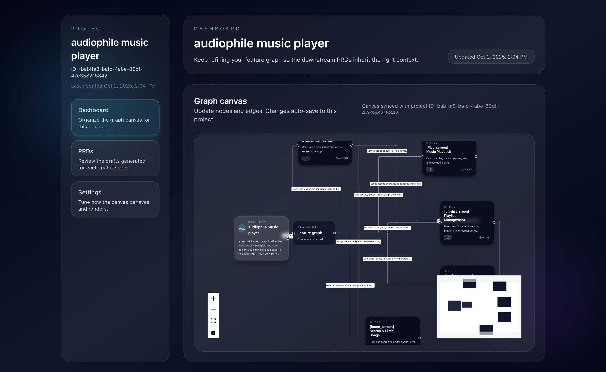
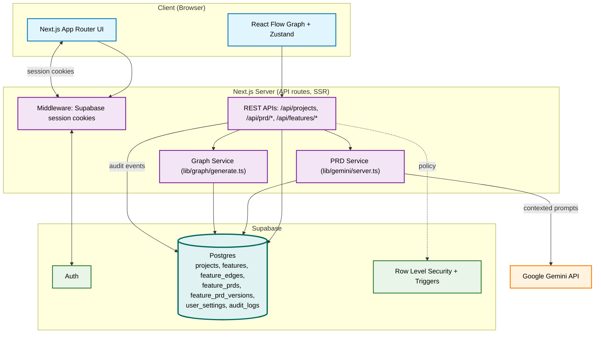
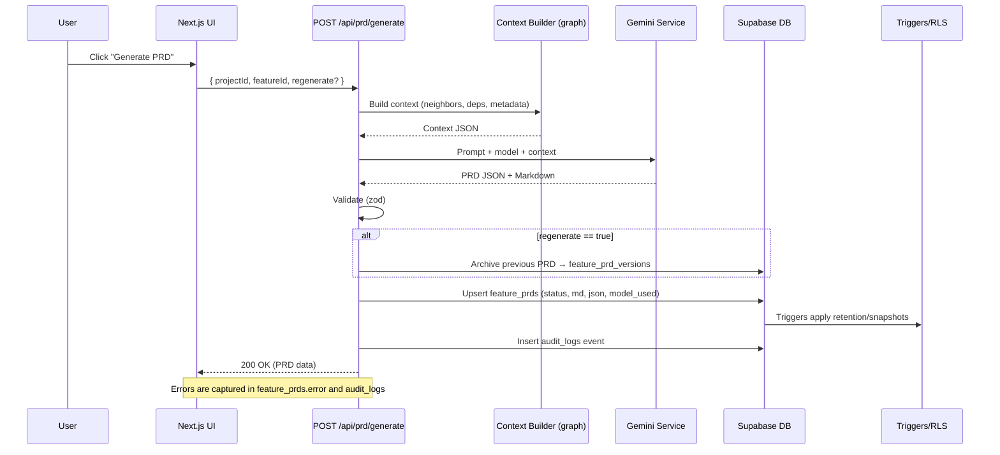

# codeWinter ❄️

[](https://nextjs.org/) [](https://www.typescriptlang.org/) [](https://tailwindcss.com/) [](https://github.com/pmndrs/zustand) [](https://supabase.com/) [](https://reactflow.dev/) [](https://ai.google.dev/gemini-api) [](https://github.com/colinhacks/zod) [](https://github.com/remarkjs/react-markdown) [](https://github.com/remarkjs/remark-gfm) [](https://bun.sh/)

AI‑assisted Product Requirements for your feature graph. codeWinter turns a project’s feature list into a dependency graph and generates consistent, professional PRDs per feature.

## APP UI



## Core Features

- Create a project with 5–10 features and get an auto‑arranged architecture graph
- Generate a PRD for any feature using Google Gemini with project/graph context
- Keep prior PRD versions for 7 days when you regenerate
- Download PRDs as Markdown with deterministic filenames
- Audit trail for key events (graph generate, PRD start/success/error, downloads)

## How it works

1. You create a project with features → we persist and immediately attempt a graph using Gemini. If your Gemini key isn’t configured yet, we fall back to a minimal graph and continue.

2. You connect your Gemini API key once in Settings. We encrypt it at rest using AES‑256‑GCM and store it in `user_settings`.

3. When you generate a PRD for a feature, we build rich context from the graph (connected features, incoming/outgoing dependencies) and call Gemini. The result is structured (JSON) + Markdown, saved in `feature_prds`.

4. If you regenerate, the previous PRD is copied to `feature_prd_versions` and expires in 7 days (via triggers). All important events are logged in `audit_logs`.

See the full technical spec in `TECHNICAL_SPEC.md`.

## Stack

- Next.js 15
- TypeScript, Tailwind CSS (v4)
- Zustand for graph state
- Supabase (Auth, Database, RLS policies) with SSR/Edge clients
- React Flow for graph editing/visualization
- Gemini AI
- `zod` for input validation, `react-markdown` + `remark-gfm` for PRD rendering

## Quick start

1. Configure environment variables in `.env.local`

```bash
NEXT_PUBLIC_SUPABASE_URL=                       # your Supabase project URL
NEXT_PUBLIC_SUPABASE_PUBLISHABLE_KEY=           # Supabase publishable key
NEXT_PUBLIC_SUPABASE_ANON_KEY=                  # Supabase anon key
NEXT_PUBLIC_SUPABASE_SERVICE_ROLE_KEY=          # Supabase service role key
NEXT_PUBLIC_SUPABASE_PROJECT_REF=               # Supabase project reference code

NEXT_PUBLIC_CRON_SECRET=                        # cron secret
NEXT_PUBLIC_GEMINI_API_KEY=                     # Gemini API key
NEXT_PUBLIC_ENCRYPTION_KEY=                     # Gemini API encryption key
```

```bash
bun install                                     # install
bun run dev                                     # run
```

2. Sign in → Settings → paste your Gemini API key. We verify the key against Google’s endpoint and store it encrypted.

3. Create a project with 5–10 features, open a feature and click Generate PRD.

## Scripts

```bash
npm run dev       # dev server
npm run build     # production build
npm run start     # serve production

npm run lint      # ESLint (Next.js config)
npm run typecheck # TypeScript project check
npm run format    # Prettier write
npm run format:check # Prettier check (CI / pre-commit)
```

## Architecture

### System overview



- SSR uses Supabase session cookies for authenticated API access.
- Graph editing runs client-side with React Flow + Zustand; persistence happens via API.
- Supabase enforces RLS; triggers handle PRD versioning and retention.
- Gemini is called server-side with structured prompts built from the project graph.

### PRD generation flow



### Components map

- UI: `src/app`, `src/components/graph`, `src/components/prd`
- Services: `src/lib/gemini`, `src/lib/graph`
- Data access: `src/lib/supabase` (SSR/browser clients, typed DB)
- Schemas/types: `src/lib/schemas`
- Routes: `src/app/api/*`

## Directory overview

```text
web/
├─ src/
│  ├─ app/               # Next.js App Router (routes, API handlers, middleware)
│  ├─ components/        # Graph, PRD, UI
│  ├─ lib/
│  │  ├─ gemini/         # PRD generation + server helpers
│  │  ├─ graph/          # Graph generation + normalization
│  │  ├─ schemas/        # zod validation schemas
│  │  ├─ supabase/       # SSR/browser clients + typed DB
│  │  └─ store/          # Zustand store
│  └─ styles/            # Tailwind config layers
├─ public/               # Static assets
└─ supabase/             # SQL migrations (tables, RLS, triggers)
```

## API overview (selected)

All routes are authenticated via Supabase session cookies unless noted.

| Method          | Endpoint                           | Description                     | Body/Notes                                       |
| --------------- | ---------------------------------- | ------------------------------- | ------------------------------------------------ |
| POST            | `/api/projects`                    | Create project with features    | `{ name, description, features: [{ title }] }`   |
| GET             | `/api/projects`                    | List user projects              | —                                                |
| GET             | `/api/projects/:id`                | Project + features + edges      | —                                                |
| PATCH           | `/api/projects/:id`                | Update project and feature list | —                                                |
| DELETE          | `/api/projects/:id`                | Delete project                  | —                                                |
| POST            | `/api/projects/:id/graph/generate` | Regenerate project graph        | —                                                |
| GET             | `/api/projects/:id/prds`           | List features with PRD status   | —                                                |
| POST            | `/api/prd/generate`                | Start PRD for a feature         | `{ projectId, featureId, regenerate?: boolean }` |
| GET             | `/api/features/:id/prd`            | Fetch PRD data for a feature    | —                                                |
| PATCH           | `/api/prd/:id`                     | Update PRD markdown             | —                                                |
| GET             | `/api/prd/:id/download`            | Download PRD markdown           | —                                                |
| GET/POST/DELETE | `/api/settings/key`                | Manage encrypted Gemini API key | —                                                |

See Technical Spec for full request/response contracts.

## Data model (high level)

- `projects` (id, user_id, name, description, graph, created_at, updated_at)
- `features` (id, project_id, title, notes, position, created_at, updated_at)
- `feature_edges` (project_id, source_feature_id → target_feature_id, metadata)
- `feature_prds` (feature_id, status, summary, prd_md, prd_json, model_used, token_count, error, generated_at)
- `feature_prd_versions` (history with 7‑day expiry via trigger)
- `user_settings` (user_id, gemini_api_key [encrypted])
- `audit_logs` (user_id, project_id?, feature_id?, action, payload)

RLS policies ensure users can only see their own data. Triggers capture PRD audit events and snapshot PRD versions on changes.

## Contribution

- Start with an issue describing the bug or feature and the use case.
- Fork, create a branch (feat/short-desc or fix/short-desc), and open a PR referencing the issue.
- Local setup:
  - bun install; bun run dev
  - Copy envs from Quick start
  - Supabase: supabase start; supabase db reset; supabase migration new my_migration
- Code style: TypeScript strict; validate with zod; server logic in src/lib; UI in src/components; routes in src/app; prefer Tailwind.
- Checks before commit: npm run typecheck; npm run lint; npm run format:check. Husky + lint‑staged run on commit.
- Commits: Conventional Commits (feat, fix, docs, chore, refactor, test, build, ci). Example: feat(prd): add regenerate button.
- Pull requests: link issues; describe change, rationale, and impact; include screenshots for UI; update docs/types/migrations; avoid breaking APIs without notes.
- Security: report vulnerabilities privately (do not open public issues).
- Licensing: ensure dependency license compatibility; attribute or remove unclear snippets.

---

Made with ❤️ at University of London.
